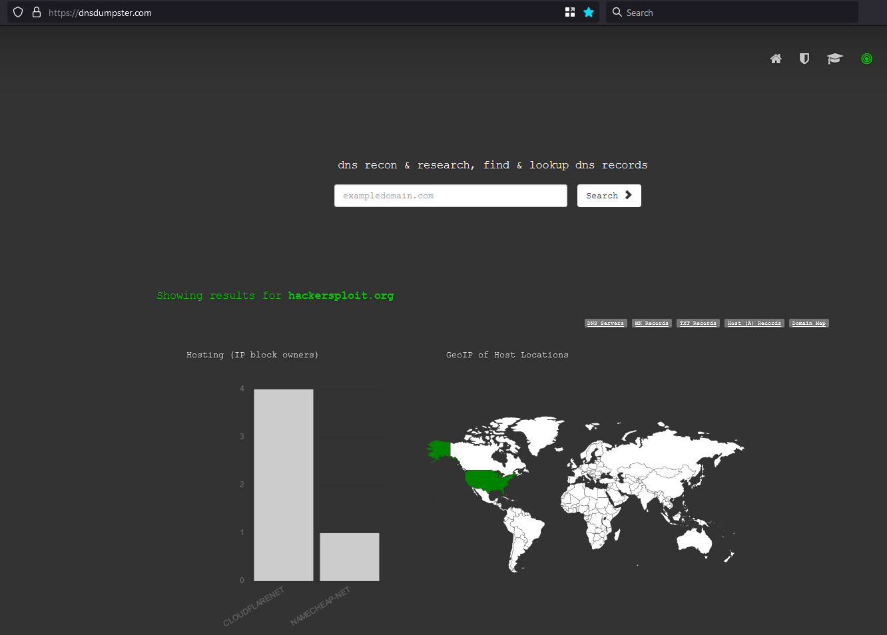
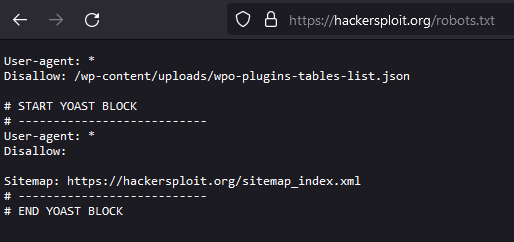
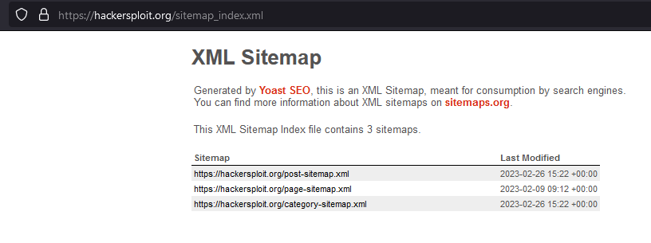
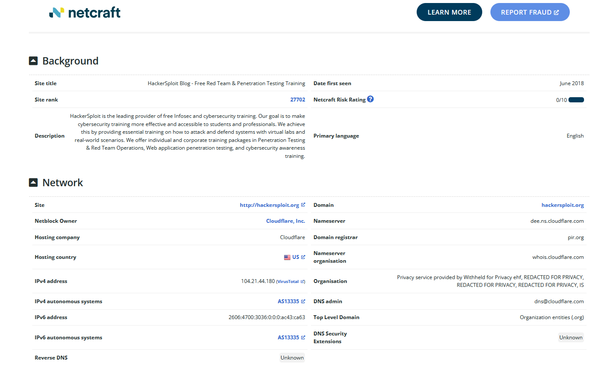
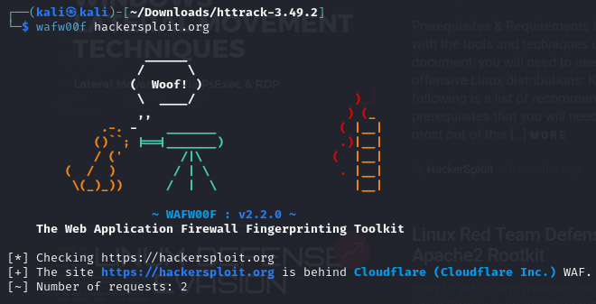
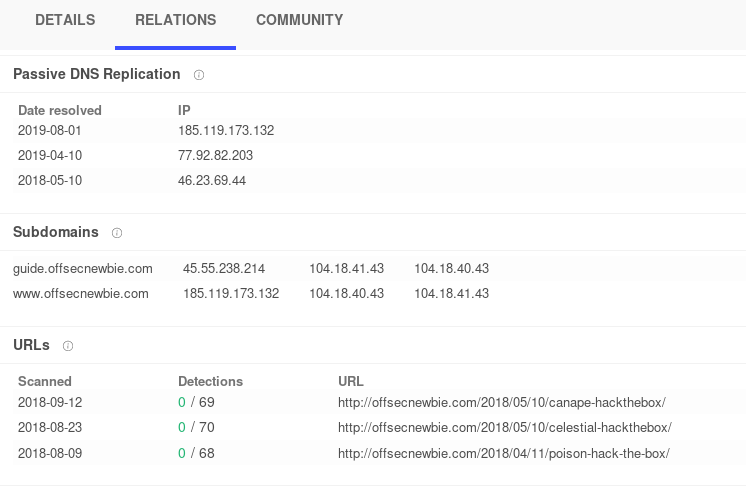

# Passive Information Gathering

## Passive Web enumeration

for DNS lookup utility use the host command

```
host hackersploit.org
```

### DNS Recon

```
dnsrecon -d hackersploit.org
```

### dnsdumpster



<figure><figcaption><p>Example result dnsdumspter</p></figcaption></figure>


### robots.txt & sitemap\_index.xml

<figure><figcaption><p>robots.txt</p></figcaption></figure>

<figure><figcaption><p>sitemap_index.xml</p></figcaption></figure>

### Whatweb&#x20;

to profile the website tech used in cli (or just use builtwith or wappalyzer in firefox addon)

```
whatweb hackersploit.org
```

### Whois

```
whois hackersploit.org
```

### Netcraft

Finds underlying OS, web server version uptime&#x20;



<figure><figcaption><p>Example netcraft result</p></figcaption></figure>

### WAF With wafw00f

```
wafw00f hackersploit.org
```

<figure><figcaption><p>wafw00f result</p></figcaption></figure>

## Google Dorks

```
site:ine.com employees
site:ine.com inurl:admin
site:*.ine.com
site:*.ine.com intitle:admin
site:*.ine.com filetype:pdf
intitle:index of
inurl:auth_user_file.txt
cache:ine.com
```

For more google dorking


Link to google dorking exploitdb


also heck out doc meta info, gives info such as where doc was stored - network share ip address, who created it, what was it created with etc&#x20;



## Wayback Machine


Link to wayback machine


## Subdomain Enumeration

### Find Subdomains

Sometimes SSL is a goldmine of information

```sh
#!/bin/bash
# a basic script to pull information from crt and present it
# example ./crt.sh offsecnewbie.com
# author rowbot
if [[ $# -eq 0 ]] ;

then
	echo "Usage: ./crt.sh domain. Also you might have to install jq - 'apt get install jq'"
	exit 1

else

curl -s https://crt.sh/\?q\=\%.$1\&output\=json | jq -r '.[].name_value' | sed 's/\*\.//g' | sort -u > $1

fi
```

Can also find subdomain using sublist3r

### sublist3r

```
sublist3r -d hackersploit.org -e yahoo,bing
```

Compare subdomains found using sublist3r & theHavester with crt.sh script as some will be missing - not all domains have ssl.

### theHarvester

```
theHarvester -d zonetransfer.me -b bing,yahoo
```

IP addresses from subdomains

```sh
for i in $(cat subdomains.txt); do dig $i | grep -o '[0-9]\{1,3\}\.[0-9]\{1,3\}\.[0-9]\{1,3\}\.[0-9]\{1,3\}' | grep -vE "10.*"; done
```

Use Virustotal to find subdomains

<figure><figcaption><p>virustotal find subdomains</p></figcaption></figure>

### Bugcrowd



FireFox addon - passive recon

## Social Media Search

```sh
// Example usage
sherlock steve
```

## Recon

A giant inventory of recon tools is available via the Skip Tracing Framework



## Find Information about a device that is connected

Create a [https://grabify.link/](https://grabify.link/) and get someone to click on it.

On device go to [https://device.info.me/](https://device.info.me/)

## List of OSINT Tools







## Leaked Password Databases


